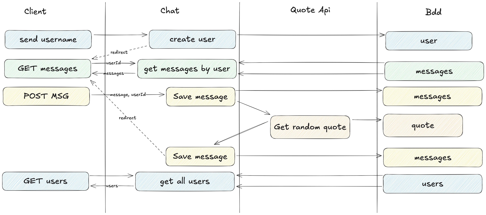

# ours en peluche
Le but est de proposer un chatbot qui répond aux employés avec des citations inspirantes et de motivation (nulles).

## Installation

```bash
git clone https://github.com/TristanRenard/ours-en-peluche.git
git clone https://github.com/TristanRenard/ours-en-peluche-api.git
```

Dans le dossier `ours en peluche` :
### Avec docker
Vous trouverez un docker-compose qui vous permettra de lancer la base de données et l'innitialiser.

### Sans docker
Il vous faudra exécuter le script `init.sql` pour initialiser la base de données sur l'instance de votre base de donnée.

## Configuration
Une fois fait il vous faudra certainement modifier le fichier `application.properties` pour que l'application puisse se connecter à la base de données avec les identifiants que vous aurez modifiés dans le docker-compose.

```bash
spring.application.name=ours-chat


spring.jpa.hibernate.ddl-auto=update
spring.devtools.restart.additional-paths=.

spring.datasource.url=jdbc:mysql://${MYSQL_HOST:localhost}:3306/mydatabase  # URL de la base de données
spring.datasource.username=myuser # Nom d'utilisateur de la base de données
spring.datasource.password=mypassword # Mot de passe de la base de données
spring.datasource.driver-class-name=com.mysql.cj.jdbc.Driver

server.port=8080 # Port du chat

bot.quote.api.url=http://localhost:8081/randomQuote # URL de l'api de citation (il vous faudra surement changer le port)
```


Dans le dossier `ours en peluche api` :

```bash
spring.application.name=ours-quote

spring.datasource.url=jdbc:mysql://${MYSQL_HOST:localhost}:3306/mydatabase  # URL de la base de données
spring.datasource.username=myuser # Nom d'utilisateur de la base de données
spring.datasource.password=mypassword # Mot de passe de la base de données
spring.datasource.driver-class-name=com.mysql.cj.jdbc.Driver

server.port=8081 # Port du chat
```

ensuite vous pouvez faire un `mvn clean install` dans les deux dossiers pour compiler les applications.
puis vous pouvez lancer les applications avec `mvn spring-boot:run` dans les deux dossiers.

## Structure
